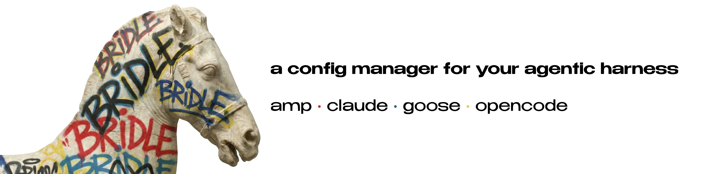

# Bridle

Unified configuration manager for AI coding assistants. Manage profiles, switch configurations, and view status across multiple harnesses from a single tool.


## Supported Harnesses

| Harness         | Config Location        | Status          |
| --------------- | ---------------------- | --------------- |
| **Claude Code** | `~/.claude`            | Full support    |
| **OpenCode**    | `~/.config/opencode`   | Full support    |
| **Goose**       | `~/.config/goose`      | Full support    |
| **AMP Code**    | `~/.config/amp`        | Full support    |

## Installation

### From crates.io

```bash
cargo install bridle
```

### From Homebrew

```bash
brew tap neiii/bridle
brew install bridle
```

### From source

```bash
git clone https://github.com/neiii/bridle
cd bridle
cargo install --path .
```

## Usage

### Launch the TUI 

```bash
bridle
# or 
bridle tui
```

Interactive dashboard to browse harnesses, profiles, and configurations.

### Quick Status

```bash
bridle status
```

Shows all installed harnesses and active profiles:

```
Harnesses:
  Claude Code - installed
    Config: ~/.claude
  OpenCode - installed
    Config: ~/.config/opencode
  Goose - installed
    Config: ~/.config/goose
  AMP Code - installed
    Config: ~/.config/amp

Active Profiles:
  claude-code: default
  opencode: maestro
  goose: default
  amp-code: default
```


### Profile Management

```bash
# List profiles for a harness
bridle profile list opencode

# Show profile details (model, MCP servers, plugins, etc.)
bridle profile show opencode maestro

# Create profile from current config
bridle profile create opencode backup --from-current

# Switch active profile
bridle profile switch opencode maestro

# Compare profiles
bridle profile diff opencode default maestro

# Edit profile with $EDITOR
bridle profile edit opencode maestro
```

### JSON Output

All commands support JSON output for scripting:

```bash
bridle status --output json
bridle profile show claude-code default -o json
```

## What Bridle Manages

For each harness, Bridle can read and display:

- **Model** configuration
- **MCP Servers** (Model Context Protocol)
- **Plugins/Extensions**
- **Commands & Skills**
- **Theme** settings

## Configuration

Bridle stores its own config and profiles in `~/.config/bridle/`:

```
~/.config/bridle/
├── config.toml           # Bridle settings
└── profiles/
    ├── claude-code/
    │   └── default/      # Profile directory
    ├── opencode/
    ├── goose/
    └── amp-code/
```

### Settings

Configure Bridle via CLI or by editing `~/.config/bridle/config.toml`:

```bash
# View current configuration
bridle config show

# Set a configuration value
bridle config set <key> <value>
```

| Setting | Type | Default | Description |
|---------|------|---------|-------------|
| `editor` | string | `$EDITOR` or `vi` | Editor for `bridle profile edit` |
| `default_harness` | string | none | Harness to select when TUI opens |
| `profile_marker` | bool | `false` | Create marker files in harness config dirs |
| `tui.view` | string | `dashboard` | TUI view mode: `dashboard` or `legacy` |

Example `config.toml`:

```toml
editor = "code --wait"
default_harness = "opencode"
profile_marker = true

[tui]
view = "dashboard"

[active]
opencode = "maestro"
claude-code = "default"
```

### Profile Markers

When `profile_marker = true`, Bridle creates a `BRIDLE_PROFILE_<name>` file in each harness's config directory when switching profiles. This lets other tools detect which Bridle profile is active.

```bash
# Enable profile markers
bridle config set profile_marker true

# After switching profiles, you'll see:
# ~/.config/opencode/BRIDLE_PROFILE_maestro
# ~/.claude/BRIDLE_PROFILE_default
```

Use cases:
- Shell prompts that show the active profile
- Scripts that behave differently per profile
- Editor plugins that need profile awareness

## License

MIT License - see [LICENSE](LICENSE) for details.
